# Pipeline Overview — How Everything Works

**Last updated:** 2026-05-20 (revised — image pipeline fixes, preview workflow added)

This document explains every workflow in the pipeline with step-by-step diagrams.

---

## 1. System Architecture

How all the components connect.

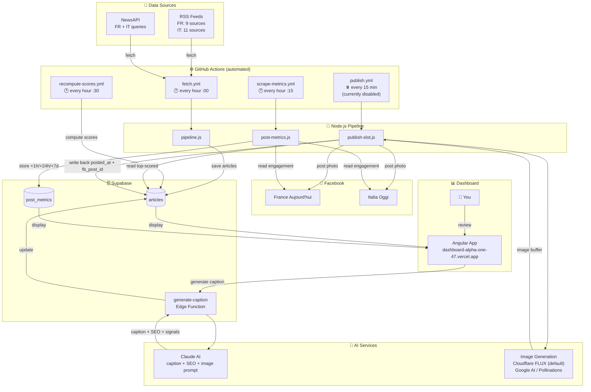

---

## 2. Article Lifecycle

Every article goes through these status transitions from fetch to posted.

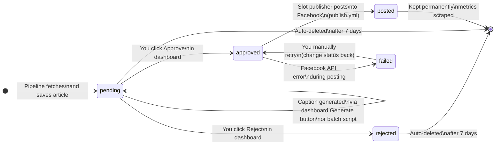

---

## 3. Fetch Pipeline

Runs every hour at `:00`. Fetches articles, scores them, and saves to Supabase.

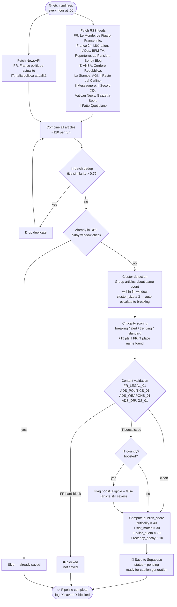

---

## 4. Caption Generation

Triggered manually from the dashboard (Generate button) or via batch script.

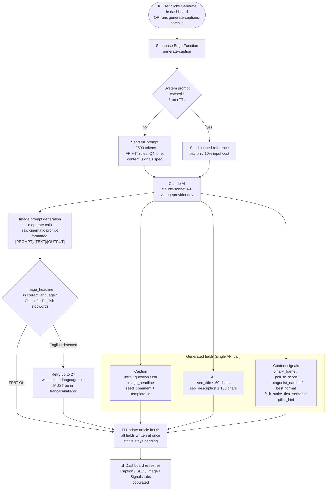

---

## 5. Dashboard Review Flow

How you review, approve, and prepare articles for posting.

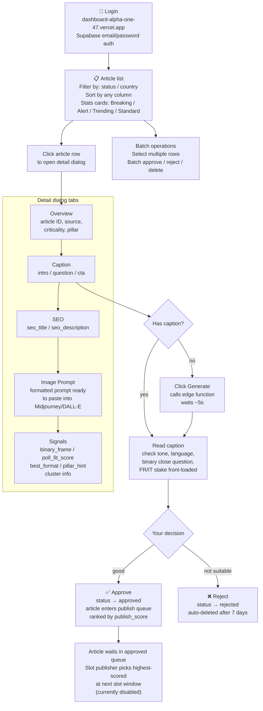

---

## 6. Slot Publisher Flow

Runs every 15 min (currently disabled). Posts the highest-scored approved article at each slot.

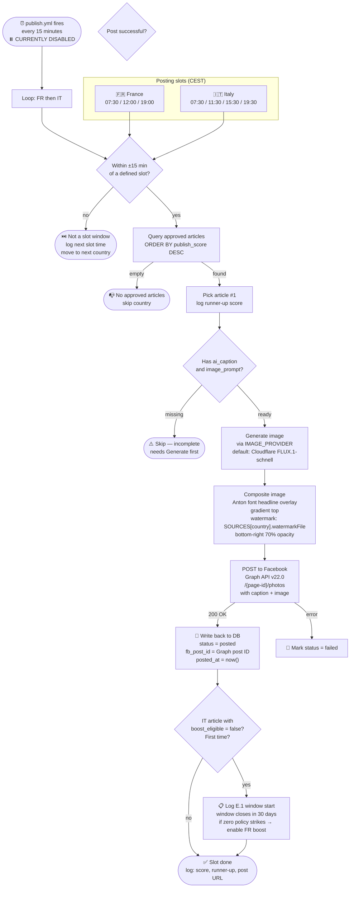

---

## 7. Local Preview Workflow (pre-post review)

Before posting, you can generate and inspect images locally without touching Facebook.

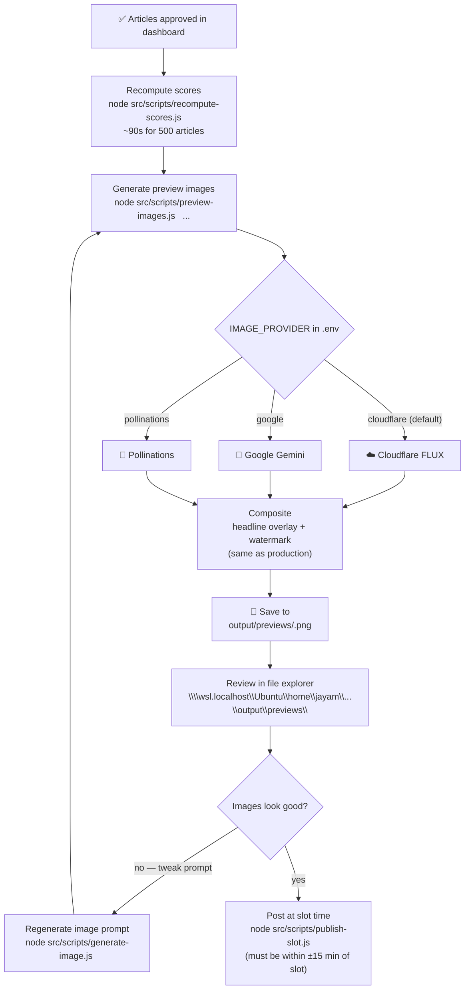

**Posting slots (run publish-slot.js within ±15 min of each):**

| Country | Slot 1 | Slot 2 | Slot 3 | Slot 4 |
|---|---|---|---|---|
| 🇫🇷 France | 07:30 CEST | 12:00 CEST | 19:00 CEST | — |
| 🇮🇹 Italy | 07:30 CEST | 11:30 CEST | 15:30 CEST | 19:30 CEST |

**Watermark files (assets/logos/):**

| Country | File |
|---|---|
| FR | `FranceAujourdhui_Logo.png` |
| IT | `vivere_in_italia_banner_logo.png` |

---

## 8. Engagement Metrics Scraper (was §7)

Runs every hour at `:15`. Scrapes post engagement from the Facebook Graph API.

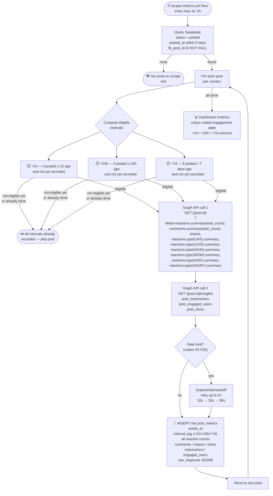

---

## 9. GitHub Actions Schedule

How the four workflows are staggered across each hour to avoid conflicts.

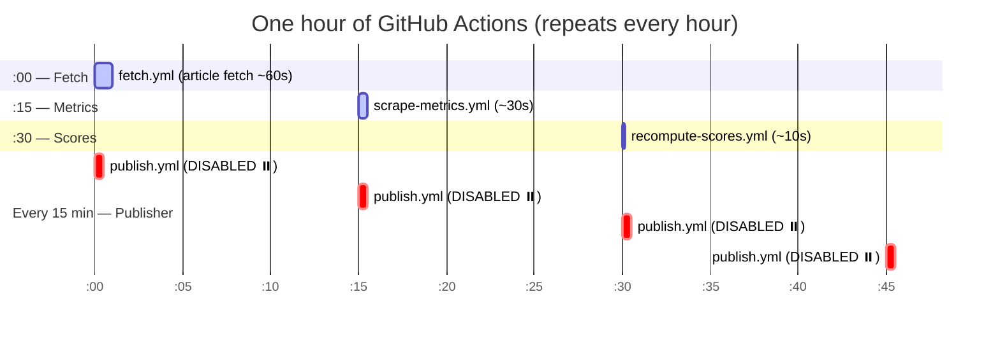

---

## 10. Image Generation Providers

How the multi-provider image generation system works.

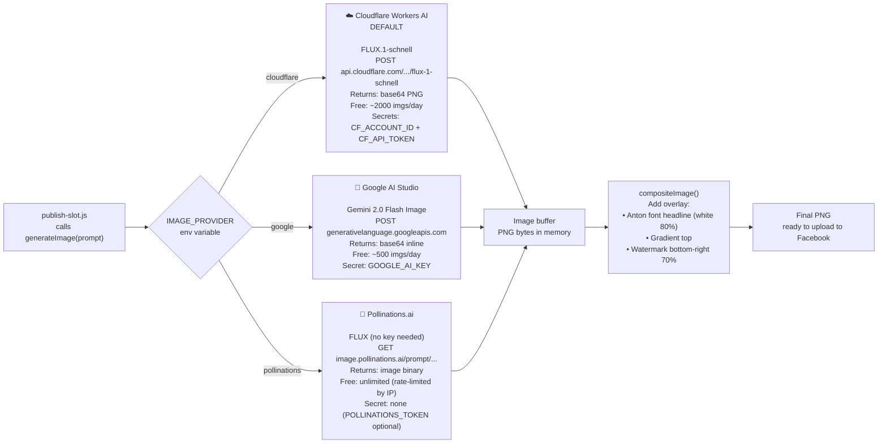

**To switch providers:** update the `IMAGE_PROVIDER` variable in GitHub → Settings → Secrets and variables → Actions → Variables tab. No code change or redeployment needed.

---

## 11. Publish Score Formula

How the pipeline decides which approved article to post at each slot.

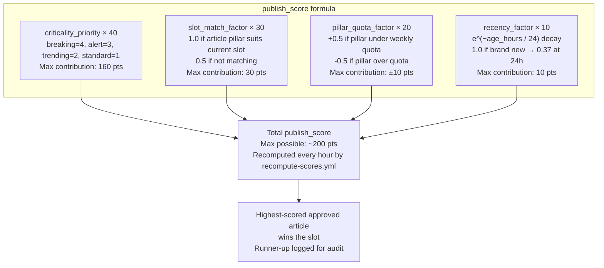
